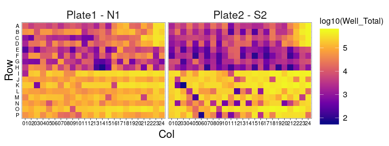
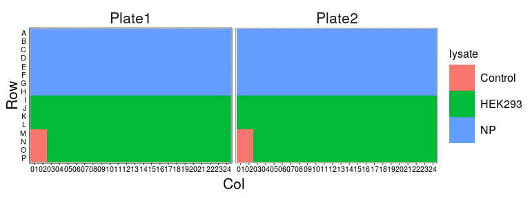
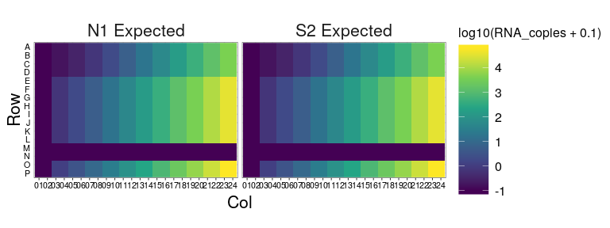
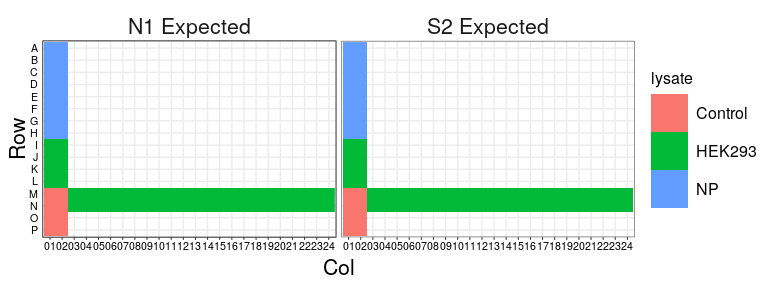
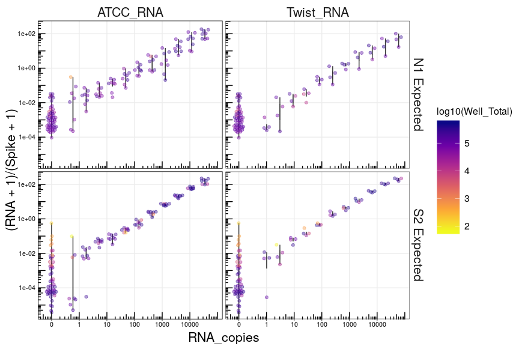
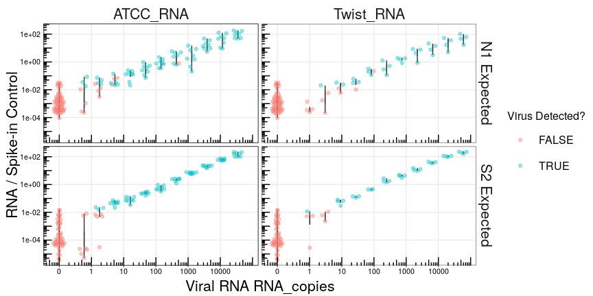
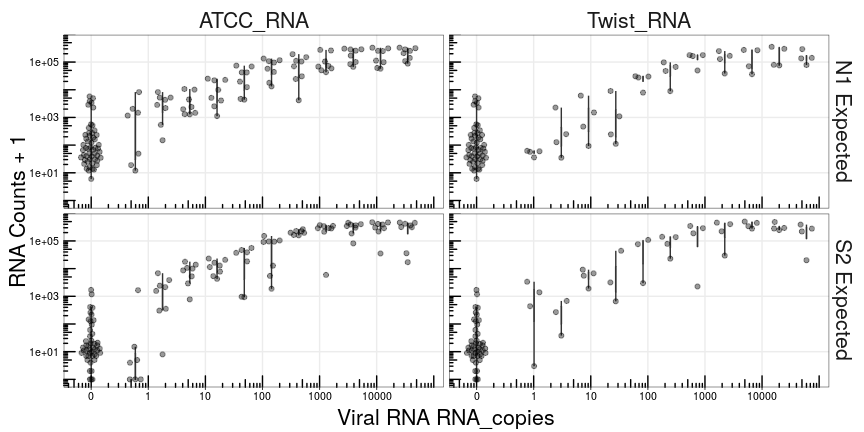
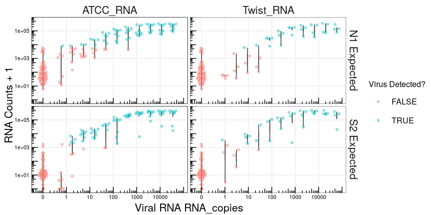
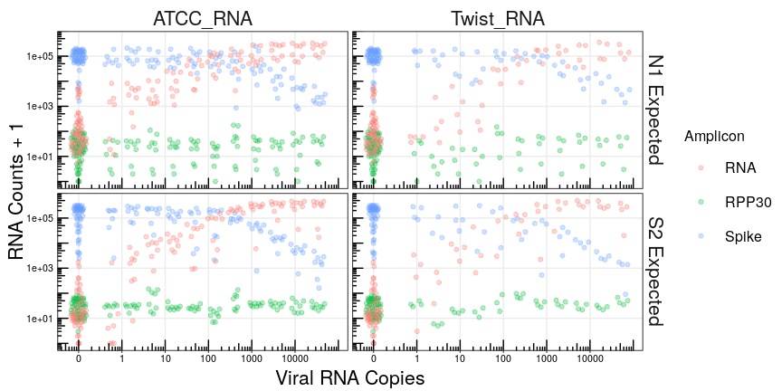

Example Analysis
================
Nate
04/03/2020

  - [Setup](#setup)
      - [Getting Oriented](#getting-oriented)
      - [Explicit Zeros](#explicit-zeros)
  - [QC](#qc)
      - [Spike-in Cross-over](#spike-in-cross-over)
  - [Expression Relative to
    Spike-in’s](#expression-relative-to-spike-ins)
      - [Tidy-up](#tidy-up)
      - [Detection Plots](#detection-plots)
  - [General Classifier](#general-classifier)
      - [HEK293 Lysate Classification](#hek293-lysate-classification)
  - [Do We Need Spikes?](#do-we-need-spikes)
      - [Primer Competition Effects](#primer-competition-effects)

# Setup

Import and load everything

``` r
# plotting
library(ggbeeswarm) # <- geom_quasirandom

# stats
library(MASS) # <- glm.nb
library(speedglm)

# tidyverse
library(furrr) # <- parallel map (future_map, plan) (devtools for walk)
library(readxl) # <- read_xlsx
library(magrittr)
library(tidyverse)

select = dplyr::select #, MASS::select masks dplyr...

# ------------------------------------------------------------------------------------
# style plots

theme_pub <- function(base_size = 11, base_family = "") {
  # based on https://github.com/noamross/noamtools/blob/master/R/theme_nr.R
  # start with theme_bw and modify from there!
  theme_bw(base_size = base_size, base_family = base_family) +# %+replace%
    theme(
      # grid lines
      panel.grid.major.x = element_line(colour="#ECECEC", size=0.5, linetype=1),
      panel.grid.minor.x = element_blank(),
      panel.grid.minor.y = element_blank(),
      panel.grid.major.y = element_line(colour="#ECECEC", size=0.5, linetype=1),
      panel.background   = element_blank(),
      
      # axis options
      axis.ticks.y   = element_blank(),
      axis.title.x   = element_text(size=rel(2), vjust=0.25),
      axis.title.y   = element_text(size=rel(2), vjust=0.35),
      axis.text      = element_text(color="black", size=rel(1)),
      
      # legend options
      legend.title    = element_text(size=rel(1.5)),
      legend.key      = element_rect(fill="white"),
      legend.key.size = unit(1, "cm"),
      legend.text     = element_text(size=rel(1.5)),
      
      # facet options
      strip.text = element_text(size=rel(2)),
      strip.background = element_blank(),
      
      # title options
      plot.title = element_text(size=rel(2.25), vjust=0.25, hjust=0.5)
    )
}
theme_set(theme_pub(base_size=8))

# ------------------------------------------------------------------------------------

# workaround to enable multicore with new rstudio versions
options(future.fork.enable = TRUE)
plan(multicore)
set.seed(42)

# ------------------------------------------------------------------------------------
# load data

guess_max <- 100000
run_id = 'example'

# barcode counts
counts <- read_csv(paste0('../../pipeline/', run_id, '/starcode.csv'))
well.total <- counts %>%
  distinct(Sample_ID, Centroid, Count)  %>%
  count(Sample_ID, wt=Count, name = 'Well_Total') 

# well metadata
cond <- read_csv(paste0('../../pipeline/', run_id, '/conditions.csv'), guess_max=guess_max) 

# link barcode to amplicons
bc.map <- read_csv('../../data/barcode-map.csv') 
```

## Getting Oriented

Let’s make sense of the relevant parameters here. In each well, we are
trying to quantify the counts of 5 different barcodes:

``` r
cond %>%
  distinct(bc_set) %>%
  inner_join(bc.map) %>%
  arrange(target)
```

    ## Joining, by = "bc_set"

    ## # A tibble: 5 x 4
    ##   bc_set      sequence                   target     amplicon
    ##   <chr>       <chr>                      <chr>      <chr>   
    ## 1 N1_S2_RPP30 CGCAGAGCCTTCAGGTCAGAACCCGC RPP30      RPP30   
    ## 2 N1_S2_RPP30 TATCTTCAACCTAGGACTTTTCTATT SARS-CoV-2 S2      
    ## 3 N1_S2_RPP30 ACCAAACGTAATGCGGGGTGCATTTC SARS-CoV-2 N1      
    ## 4 N1_S2_RPP30 ATAGAACAACCTAGGACTTTTCTATT spike      S2_spike
    ## 5 N1_S2_RPP30 TGGTTTCGTAATGCGGGGTGCATTTC spike      N1_spike

one representing the housekeeping gene RPP30, two representing different
amplicons from the COVID-19, and two different spike in controls (one
for each amplicon).

In reality, we measure more than the 5 barcodes barcodes in each well.
Let’s print the top 10 most common barcodes (denoted here as centroid as
we collapse barcodes at a Levenshtein distance of 2) and their counts in
an example well

``` r
counts %>%
  filter(Sample_ID == 'Plate1-A01') %>%
  distinct(Sample_ID, Centroid, Count) %>%
  mutate(bc_set = 'N1_S2_RPP30') %>%
  left_join(bc.map %>% rename(Centroid = sequence)) %>%
  head(n=10)
```

    ## Joining, by = c("Centroid", "bc_set")

    ## # A tibble: 10 x 6
    ##    Sample_ID  Centroid                   Count bc_set      target     amplicon
    ##    <chr>      <chr>                      <dbl> <chr>       <chr>      <chr>   
    ##  1 Plate1-A01 TGGTTTCGTAATGCGGGGTGCATTTC 12279 N1_S2_RPP30 spike      N1_spike
    ##  2 Plate1-A01 ACCAAACGTAATGCGGGGTGCATTTC   734 N1_S2_RPP30 SARS-CoV-2 N1      
    ##  3 Plate1-A01 TTGGTTTCGTGATGCGGGGTGCATTT    67 N1_S2_RPP30 <NA>       <NA>    
    ##  4 Plate1-A01 TGGCTTCGTTAATGCGGGGTGCATTT    62 N1_S2_RPP30 <NA>       <NA>    
    ##  5 Plate1-A01 GGTTCGTAATGCGGGGTGCATTTCGC    33 N1_S2_RPP30 <NA>       <NA>    
    ##  6 Plate1-A01 CGCAGAGCCTTCAGGTCAGAACCCGC    15 N1_S2_RPP30 RPP30      RPP30   
    ##  7 Plate1-A01 AGCATACCAAAAACGTCATAAAAATC    11 N1_S2_RPP30 <NA>       <NA>    
    ##  8 Plate1-A01 TGGTTTCGTACTGCGGGTGCATTTCG    10 N1_S2_RPP30 <NA>       <NA>    
    ##  9 Plate1-A01 ATTCATCTAGCTGTGGGATTGGGCAT     8 N1_S2_RPP30 <NA>       <NA>    
    ## 10 Plate1-A01 AGGATACGTAATGCGGGGTGCATTTC     3 N1_S2_RPP30 <NA>       <NA>

We can see that fortunately majority of reads in any well will
correspond to sequences associated with our barcodes. Other sequences
are likely PCR errors or contaminants.

### Reads per Well

Let’s get a sense for how even our sampling per well is. To do this,
we’ll simply add up all of the counts for all of the barcodes in each
well.

``` r
# recall this is equivalent to well.total above
counts %>%
  distinct(Sample_ID, Centroid, Count)  %>%
  count(Sample_ID, wt=Count, name = 'Well_Total') %>%
  inner_join(cond) %>%
  separate(Sample_ID, into = c('Sample_Plate', 'Well'), sep = '-', remove=F) %>%
  mutate(
    Row = factor(str_sub(Well, 1, 1), levels = rev(LETTERS[1:16])),
    Col = str_sub(Well, 2)
  ) %>%
  ggplot(aes(x=Col, y=Row, fill=log10(Well_Total))) +
  geom_raster() +
  coord_equal() +
  facet_wrap(~paste(Sample_Plate, nCoV_amplicon, sep = ' - ')) +
  scale_fill_viridis_c(option = 'plasma')
```

<!-- -->

We can see a bifurcation in total reads between the top and bottom halfs
of the plate. If we go back to our `cond` dataframe (which recall has
all of the relevant metadata for each well)

``` r
well.total %>%
  separate(Sample_ID, into = c('Sample_Plate', 'Well'), sep = '-', remove=F) %>%
  mutate(
    Row = factor(str_sub(Well, 1, 1), levels = rev(LETTERS[1:16])),
    Col = str_sub(Well, 2)
  ) %>%
  inner_join(cond) %>%
  ggplot(aes(x=Col, y=Row, fill=lysate)) +
  geom_raster() +
  coord_equal() +
  facet_wrap(~Sample_Plate)
```

<!-- -->

we can see that the difference in reads comes from the sample prep -
lysate from either nasopharyngeal (NP) swabs, HEK293, or no HEK293
lysate controls.

## Explicit Zeros

Since we know what barcodes to expect in each well, we can add explicit
zeros to barcodes that drop out.

``` r
explicit.zeros <- function(df, bc.map) {
  # take only assays and targets from the current run
  # assumes df has been joined with condition sheet
  bc.map %>%
    filter(
      bc_set %in% unique(df$bc_set),
    ) %>%
    left_join(df, by = c('sequence', 'bc_set')) %>%
    replace_na(list(Count = 0))
}

# drop the centroid column as it's not needed
# coerce Count to integer to avoid weird scientic notation behavior in format_csv
df <- counts %>%
  select(-Centroid) %>%
  rename(sequence=barcode) %>% 
  inner_join(select(cond, Sample_ID, bc_set), by = 'Sample_ID') %>% 
  group_by(Sample_ID) %>%
  group_nest() %>%
  mutate(foo = future_map(data, ~explicit.zeros(.x, bc.map))) %>%
  select(-data) %>%
  unnest(foo) %>%
  inner_join(cond) %>%
  mutate(
    Row = factor(str_sub(Sample_Well, 1, 1), levels = rev(LETTERS)),
    Col = str_sub(Sample_Well, 2),
    expected_amplicon = if_else(nCoV_amplicon == 'N1', "N1 Expected", "S2 Expected")
  ) %>%
  select(-nCoV_amplicon)
```

# QC

## Spike-in Cross-over

In this particular experiment, we separated our two different spike-in
across the two different plates. Let’s see how much cross-over we had

``` r
df %>%
  filter(str_detect(amplicon, "spike")) %>%
  ggplot(aes(x=Col, y=Row, fill=log10(Count+1))) +
  geom_raster() +
  coord_equal() +
  facet_grid(expected_amplicon ~ amplicon) +
  scale_fill_viridis_c(option = 'plasma')
```

<!-- -->

We can see that although there is some cross-over present, it is to a
very limited extent\!

# Expression Relative to Spike-in’s

In addition to different sample preps, we used three different sources
of COVID-19 RNA - heat inactivated virus from ATCC, COVID-19 RNA from
ATCC, and COVID-19 RNA from Twist. We spiked these samples over a large
concentration range to test the sensitivity of our method.

``` r
df %>%
  ggplot(aes(x=Col, y=Row, fill=log10(RNA_copies+0.1))) +
  geom_raster() +
  coord_equal() +
  facet_wrap(~expected_amplicon) +
  scale_fill_viridis_c()
```

<!-- -->

## Tidy-up

Let’s break out the barcode counts into various columns as we will be
comparing across them. To do this, we’ll filter out any of barcodes that
aren’t expected for that condition (e.g. remove `N1` reads from the `S2`
plate). We can then re-cast them as either `RNA` or `Spike` and spread,
so that we have `RPP30`, `Spike`, or `RNA` columns. Recall, that we will
still have the `expected_amplicon` column to tell you what the `Spike`
and `RNA` columns refer to. We’ll also drop some of the less relevant
meta data.

``` r
df.wide <- df %>%
  select(Sample_ID, Plate_ID, Row, Col, bc_set, lysate, expected_amplicon, RNA_origin, RNA_copies, amplicon, Count) %>%
  filter(amplicon == 'RPP30' | str_detect(expected_amplicon, str_sub(amplicon, end=2)))  %>%
  mutate(amplicon = case_when(amplicon == 'RPP30' ~ 'RPP30',
                              str_detect(amplicon, 'spike') ~ 'Spike',
                              TRUE ~ 'RNA')
  ) %>%
  spread(amplicon, Count)
```

### Null Distribution

From the above plot, we can actually see that we have a large number of
control wells that we can pull from. Since these wells lack any
exogenous RNA-spikes, we can pool them together. We must take into
acount what lysate the orginated from, however.

``` r
df.wide %>%
  filter(RNA_copies == 0) %>%
  ggplot(aes(x=Col, y=Row, fill=lysate)) +
  geom_raster() +
  coord_equal() +
  facet_wrap(~expected_amplicon)
```

<!-- -->

Let’s add the nulls to each of the different experiments. Again, we drop
the `RNA_origin` column since the nulls are being pooled, but we keep
`lysate` and `expected_amplicon` to ensure the nulls are properly
divided within a plate

``` r
nulls <- df.wide %>%
  filter(RNA_copies == 0) %>%
  select(-RNA_origin) %>%
  nest(null.df = c(-expected_amplicon, -lysate))

df.wide.nulls <- df.wide %>%
  filter(RNA_copies != 0) %>%
  nest(data = c(-expected_amplicon, -lysate, -RNA_origin)) %>%
  inner_join(nulls) %>%
  mutate(combo = map2(data, null.df, bind_rows)) %>%
  select(-data, -null.df) %>%
  unnest(combo)
```

## Detection Plots

How can we tell if our method is working? Recall, we spike in a constant
ammount of an exogenous RNA template (modified so we can identify it via
sequencing) corresponding to the region of the viral genome we are
trying to amplify. Since the resulting amplicons of the spike-in and
viral RNA are practically identical (thus limiting potential
amplification biases), differences in abundance of the viral RNA
relative to the spike-in are mostly due to differences in initial viral
copy-number.

### HEK293 Lysate

Let’s plot the ratio of viral RNA to spike-in as a function of
increasing initial viral RNA RNA\_copies. We’ll restrict our analysis to
the HEK293 lysate as the NP samples didn’t amplify enough (see earlier
reads per well plots).

``` r
df.wide.nulls %>%
  filter(lysate == 'HEK293') %>%
  inner_join(well.total) %>%
  mutate(RNA_copies = if_else(RNA_copies == 0, 0.1, RNA_copies)) %>%
  ggplot(aes(x=RNA_copies, y=(RNA+1)/(Spike+1), group=RNA_copies)) +
  geom_boxplot(outlier.shape = NA) +
  geom_quasirandom(alpha=0.4, aes(color=log10(Well_Total))) +
  scale_x_log10(breaks = c(10^(-1:4)), labels = c(0,10^(0:4))) +
  scale_y_log10() +
  scale_color_viridis_c(option = 'plasma', direction = -1) +
  annotation_logticks() +
  facet_grid(expected_amplicon ~ RNA_origin)
```

<!-- -->

We can see that indeed, we are getting detection from the various RNA
samples in HEK293 lysate. We can also see a systematic upward bias in
the ratio for wells that have low counts. The graphs here are a bit
nasty because `ggplot` is having a hard time setting the boxplot width
on a continuous axis…

### Simple Classifier

We can build a simple classifier by using null distribution (wells
without viral RNA input) to set our limit of detection. We’ll illustrate
this concept on one RNA-Primer pair and generalize later. We’ll drop any
wells with \< 1000 reads as well.

``` r
test.df <- df.wide.nulls %>%
  inner_join(well.total) %>%
  filter(
    lysate == 'HEK293',
    expected_amplicon == 'S2 Expected',
    RNA_origin == 'ATCC_RNA',
    Well_Total >= 1000
  )

test.df %>%
  inner_join(well.total) %>%
  mutate(RNA_copies = if_else(RNA_copies == 0, 0.1, RNA_copies)) %>%
  ggplot(aes(x=RNA_copies, y=(RNA+1)/(Spike+1), group=RNA_copies)) +
  geom_boxplot(outlier.shape = NA) +
  geom_quasirandom(alpha=0.4, aes(color=log10(Well_Total))) +
  scale_x_log10(breaks = c(10^(-1:4)), labels = c(0,10^(0:4))) +
  scale_y_log10() +
  scale_color_viridis_c(option = 'plasma', direction = -1) +
  annotation_logticks()
```

<!-- -->

From an initial inspection, it looks like we’re able to detect \~1 copy
of viral RNA. One approach would be to perform a one-sided, one-sample
t-test of every point relat=ve to the null distribution. We’ll take this
a step further by parameterizing our data with the negative binomial
distribution. This takes into account the count-based nature of our
data, as well as the over-dispersion commonly seen in sequencing
datasets.

``` r
# estimate dispersion from nulls
theta <- test.df %>%
  filter(RNA_copies == 0) %>%
  glm.nb(RNA ~ offset(log(Spike)) + RPP30, data=.) %$%
  theta
```

Next we need to run the actual tests. To do this we will run a negative
binomial regression for each well relative to the null. This will
require some munging to get the nulls at each position and to get the
regression to perform a one-sided rather than a two-sided test.

``` r
# note we're using speedglm here instead of glm as it's more numerically stable
# exctract the t-statistic for the well
# run a one-sided, one-tailed, t-test
tidy.nb <- function(df, theta){
  nb <- speedglm(RNA ~ var + RPP30 + offset(log(Spike)), 
                 family=negative.binomial(theta=theta),
                 maxit=1000,
                 data=df)
  # recall summary goes: estimate, std. error, t.val, p.val
  # the coefs are stored in a data.frame
  var.effect <- summary(nb)$coefficients[2,]
  deg.free <- nb$df
  p.val <- pt(var.effect[1,3], df=deg.free, lower.tail=F)
  
  out.df = tibble(
    Estimate = var.effect[1,1],
    StdErr = var.effect[1,2],
    t.val = var.effect[1,3],
    p.val = p.val
  )
  return(out.df)
}

# collapse the relevant parameters into a list df 
# bind the null data to them
# re-level so the model compares to Null
bind.null <- function(null, data){
  null %>%
    select(RNA, Spike, RPP30) %>%
    mutate(var = 'Null') %>%
    bind_rows(data %>% mutate(var = 'Well')) %>%
    mutate(var = factor(var, levels = c('Null', 'Well')))
}

# grab the null distribution so we can bind it to each well
test.null <- test.df %>%
  filter(RNA_copies == 0) %>%
  select(expected_amplicon,  lysate, RNA, Spike, RPP30) %>%
  nest(null = c(-expected_amplicon, -lysate))

# collapse each well, bind in the null, run the regression, correct for testing
test.classify <- test.df %>%
  nest(data = c(RNA, Spike, RPP30)) %>%
  inner_join(test.null) %>%
  mutate(
    df.null = map2(null, data, bind.null),
    nb = map(df.null, ~tidy.nb(.x, theta))
  )  %>%
  select(-null, -df.null) %>%
  unnest(c(nb, data)) 

# grab the largest t-statistic to use as a cutoff for the nulls
max.t.test <- test.classify %>%
  filter(RNA_copies == 0) %$%
  max(t.val)
```

Let’s color our points by whether or not they’re different than the
nulls, using the max t-statistic in the null distribution as a cutoff

``` r
test.classify %>%
  mutate(
    RNA_copies = if_else(RNA_copies == 0, 0.1, RNA_copies),
    Detected = t.val > max.t.test
  ) %>%
  ggplot(aes(x=RNA_copies, y=(RNA+1)/(Spike+1), group=RNA_copies)) +
  geom_boxplot(outlier.shape = NA) +
  geom_quasirandom(alpha=0.4, aes(color=Detected)) +
  scale_x_log10(breaks = c(10^(-1:4)), labels = c(0,10^(0:4))) +
  scale_y_log10() +
  annotation_logticks() +
  labs(
    title = 'Detection of ATCC COVID-19 RNA in HEK293 Lysate',
    x = 'Viral RNA RNA_copies',
    y = 'RNA / Spike-in Control',
    color = 'Virus Detected?'
  )
```

<!-- -->

# General Classifier

Extending the principles we developed above, we can run our classifier
on the HEK293 lysate samples.

``` r
# first filter our data down to the relevant core
# and remove wells < 1000 reads
classify.vals <- df.wide.nulls %>%
  inner_join(well.total) %>%
  filter(
    Well_Total > 1000,
    lysate == 'HEK293'
  )

classify.nulls <- classify.vals %>%
  filter(RNA_copies == 0) %>%
  select(expected_amplicon, lysate, RNA_origin, RNA, Spike, RPP30) %>%
  nest(null = c(-expected_amplicon, -lysate, -RNA_origin))
```

Again, first calculate the dispersion

``` r
classify.thetas <- classify.nulls %>%
  mutate(theta = map_dbl(null, ~glm.nb(RNA ~ offset(log(Spike)) + RPP30, data=.x) %$% theta)) %>%
  select(-null)
```

Like above, we’ll bind the nulls to each position and test to see if
they’re different. Here we’re taking advantage of the `future_map...`
functions to distribute everything over all available cores.

``` r
classify.fin <- classify.vals %>%
  nest(data = c(RNA, Spike, RPP30)) %>%
  inner_join(classify.thetas) %>%
  inner_join(classify.nulls) %>%
  mutate(
    df.null = future_map2(null, data, bind.null),
    nb = future_map2(df.null, theta, tidy.nb)
  ) %>%
  select(-null, -df.null) %>%
  unnest(c(data, nb)) 
```

## HEK293 Lysate Classification

``` r
max.t.classify <- classify.fin %>%
  filter(RNA_copies == 0) %>%
  group_by(expected_amplicon, lysate, RNA_origin) %>%
  summarise(
    max.t = max(t.val),
    n.null = n()
  ) %>%
  ungroup()

classify.fin %>%
  inner_join(max.t.classify) %>%
  mutate(
    RNA_copies = if_else(RNA_copies == 0, 0.1, RNA_copies),
    Detected = t.val > max.t
  ) %>%
  ggplot(aes(x=RNA_copies, y=(RNA+1)/(Spike+1), group=RNA_copies)) +
  geom_boxplot(outlier.shape = NA) +
  geom_quasirandom(alpha=0.4, aes(color=Detected)) +
  scale_x_log10(breaks = c(10^(-1:4)), labels = c(0,10^(0:4))) +
  scale_y_log10() +
  annotation_logticks() +
  facet_grid(expected_amplicon ~ RNA_origin) +
  labs(
    x = 'Viral RNA RNA_copies',
    y = 'RNA / Spike-in Control',
    color = 'Virus Detected?'
  )
```

<!-- -->

# Do We Need Spikes?

What does our limit of detection look like sans spikes?

``` r
classify.vals %>%
  mutate(RNA_copies = if_else(RNA_copies == 0, 0.1, RNA_copies)) %>%
  ggplot(aes(x=RNA_copies, y=RNA+1, group=RNA_copies)) +
  geom_boxplot(outlier.shape = NA) +
  geom_quasirandom(alpha=0.4) +
  scale_x_log10(breaks = c(10^(-1:4)), labels = c(0,10^(0:4))) +
  scale_y_log10() +
  annotation_logticks() +
  facet_grid(expected_amplicon ~ RNA_origin) +
  labs(
    x = 'Viral RNA RNA_copies',
    y = 'RNA Counts + 1'
  )
```

<!-- -->

We can see that indeed, the variation at the low-end increases, but does
this have a meaningful impact on our ability to detect them? Note that
before we were also implicitly including RPP30 as another normalization.
We’ll remove all of these and see what happens

``` r
# note the only difference here is we have a single dummy variable that codes for null vs point
tidy.nb.spikeless <- function(df, theta){
  nb <- speedglm(RNA ~ var, 
                 family=negative.binomial(theta=theta),
                 maxit=1000,
                 data=df)
  # recall summary goes: estimate, std. error, t.val, p.val
  # the coefs are stored in a data.frame
  var.effect <- summary(nb)$coefficients[2,]
  deg.free <- nb$df
  p.val <- pt(var.effect[1,3], df=deg.free, lower.tail=F)
  
  out.df = tibble(
    Estimate = var.effect[1,1],
    StdErr = var.effect[1,2],
    t.val = var.effect[1,3],
    p.val = p.val
  )
  return(out.df)
}

# run the regression
classify.spikeless <- classify.vals %>%
  nest(data = c(RNA, Spike, RPP30)) %>%
  inner_join(classify.thetas) %>%
  inner_join(classify.nulls) %>%
  mutate(
    df.null = future_map2(null, data, bind.null),
    nb = future_map2(df.null, theta, tidy.nb.spikeless)
  ) %>%
  select(-null, -df.null) %>%
  unnest(c(data, nb)) 

# find the t-stats for the nulls
max.t.spikeless <- classify.spikeless %>%
  filter(RNA_copies == 0) %>%
  group_by(expected_amplicon, lysate, RNA_origin) %>%
  summarise(
    max.t = max(t.val),
    n.null = n()
  ) %>%
  ungroup()

# plot
classify.spikeless %>%
  inner_join(max.t.spikeless) %>%
  mutate(
    RNA_copies = if_else(RNA_copies == 0, 0.1, RNA_copies),
    Detected = t.val > max.t
  ) %>%
  ggplot(aes(x=RNA_copies, y=RNA + 1, group=RNA_copies)) +
  geom_boxplot(outlier.shape = NA) +
  geom_quasirandom(alpha=0.4, aes(color=Detected)) +
  scale_x_log10(breaks = c(10^(-1:4)), labels = c(0,10^(0:4))) +
  scale_y_log10() +
  annotation_logticks() +
  facet_grid(expected_amplicon ~ RNA_origin) +
  labs(
    x = 'Viral RNA RNA_copies',
    y = 'RNA Counts + 1',
    color = 'Virus Detected?'
  )
```

<!-- -->

We can see that indeed, the spike-ins have a positive effect on our
ability to detect low amounts of virus.

## Primer Competition Effects

``` r
classify.vals %>%
  gather(Amplicon, Count, Spike, RNA, RPP30) %>%
  mutate(RNA_copies = if_else(RNA_copies == 0, 0.1, RNA_copies)) %>%
  ggplot(aes(x=RNA_copies, y=Count+1, color=Amplicon)) +
  geom_quasirandom(alpha=0.3) +
  scale_x_log10(breaks = c(10^(-1:4)), labels = c(0,10^(0:4))) +
  scale_y_log10() +
  annotation_logticks() +
  facet_grid(expected_amplicon ~ RNA_origin) +
  labs(
    x = 'Viral RNA Copies',
    y = 'RNA Counts + 1'
  )
```

<!-- -->
