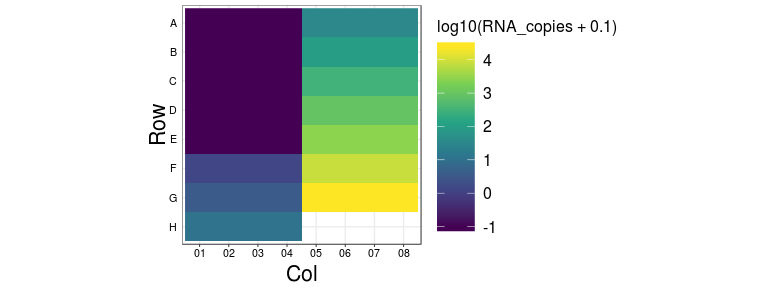
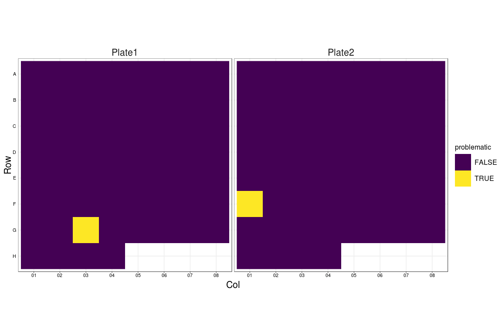

First Run
================
David K, Nate
04/29/2020

  - [Setup](#setup)
      - [Getting Oriented](#getting-oriented)
      - [Explicit Zeros](#explicit-zeros)
  - [QC](#qc)
      - [Spike-in Cross-over](#spike-in-cross-over)
  - [Expression Relative to
    Spike-in’s](#expression-relative-to-spike-ins)
      - [Tidy-up](#tidy-up)
      - [Detection Plots](#detection-plots)

# Setup

Import and load everything

``` r
# plotting
library(ggbeeswarm) # <- geom_quasirandom

# stats
library(MASS) # <- glm.nb
library(speedglm)

# tidyverse
library(furrr) # <- parallel map (future_map, plan) (devtools for walk)
library(readxl) # <- read_xlsx
library(magrittr)
library(tidyverse)

select = dplyr::select #, MASS::select masks dplyr...
count = dplyr::count
rename = dplyr::rename

# ------------------------------------------------------------------------------------
# style plots

theme_pub <- function(base_size = 11, base_family = "") {
  # based on https://github.com/noamross/noamtools/blob/master/R/theme_nr.R
  # start with theme_bw and modify from there!
  theme_bw(base_size = base_size, base_family = base_family) +# %+replace%
    theme(
      # grid lines
      panel.grid.major.x = element_line(colour="#ECECEC", size=0.5, linetype=1),
      panel.grid.minor.x = element_blank(),
      panel.grid.minor.y = element_blank(),
      panel.grid.major.y = element_line(colour="#ECECEC", size=0.5, linetype=1),
      panel.background   = element_blank(),
      
      # axis options
      axis.ticks.y   = element_blank(),
      axis.title.x   = element_text(size=rel(2), vjust=0.25),
      axis.title.y   = element_text(size=rel(2), vjust=0.35),
      axis.text      = element_text(color="black", size=rel(1)),
      
      # legend options
      legend.title    = element_text(size=rel(1.5)),
      legend.key      = element_rect(fill="white"),
      legend.key.size = unit(1, "cm"),
      legend.text     = element_text(size=rel(1.5)),
      
      # facet options
      strip.text = element_text(size=rel(2)),
      strip.background = element_blank(),
      
      # title options
      plot.title = element_text(size=rel(2.25), vjust=0.25, hjust=0.5)
    )
}
theme_set(theme_pub(base_size=8))

# ------------------------------------------------------------------------------------

# workaround to enable multicore with new rstudio versions
options(future.fork.enable = TRUE)
plan(multicore)
set.seed(42)

# ------------------------------------------------------------------------------------
# load data

guess_max <- 100000
run_id = 'first_run'

# barcode counts
counts <- read_csv(paste0('../../pipeline/', run_id, '/starcode.csv.gz'))
well.total <- counts %>%
  distinct(Sample_ID, Centroid, Count)  %>%
  count(Sample_ID, wt=Count, name = 'Well_Total') 

# well metadata
cond <- read_csv(paste0('../../pipeline/', run_id, '/conditions.csv'), guess_max=guess_max) 

# link barcode to amplicons
bc.map <- read_csv('../../data/barcode-map.csv') 
```

## Getting Oriented

Let’s make sense of the relevant parameters here. In each well, we are
trying to quantify the counts of 5 different barcodes:

``` r
cond %>%
  distinct(bc_set) %>%
  inner_join(bc.map) %>%
  arrange(target)
```

    ## Joining, by = "bc_set"

    ## # A tibble: 5 x 4
    ##   bc_set      sequence                   target     amplicon
    ##   <chr>       <chr>                      <chr>      <chr>   
    ## 1 N1_S2_RPP30 CGCAGAGCCTTCAGGTCAGAACCCGC RPP30      RPP30   
    ## 2 N1_S2_RPP30 TATCTTCAACCTAGGACTTTTCTATT SARS-CoV-2 S2      
    ## 3 N1_S2_RPP30 ACCAAACGTAATGCGGGGTGCATTTC SARS-CoV-2 N1      
    ## 4 N1_S2_RPP30 ATAGAACAACCTAGGACTTTTCTATT spike      S2_spike
    ## 5 N1_S2_RPP30 TGGTTTCGTAATGCGGGGTGCATTTC spike      N1_spike

one representing the housekeeping gene RPP30, two representing different
amplicons from the COVID-19, and two different spike in controls (one
for each amplicon).

In reality, we measure more than the 5 barcodes barcodes in each well.
Let’s print the top 10 most common barcodes (denoted here as centroid as
we collapse barcodes at a Levenshtein distance of 2) and their counts in
an example well

``` r
counts %>%
  filter(Sample_ID == 'Plate2-A01') %>%
  distinct(Sample_ID, Centroid, Count) %>%
  mutate(bc_set = 'N1_S2_RPP30') %>%
  left_join(bc.map %>% dplyr::rename(Centroid = sequence))
```

    ## Joining, by = c("Centroid", "bc_set")

    ## # A tibble: 1,705 x 6
    ##    Sample_ID  Centroid                    Count bc_set      target amplicon
    ##    <chr>      <chr>                       <dbl> <chr>       <chr>  <chr>   
    ##  1 Plate2-A01 ATAGAACAACCTAGGACTTTTCTATT 492454 N1_S2_RPP30 spike  S2_spike
    ##  2 Plate2-A01 TAGAGCAACCTAGGACTTTTCTATTA    839 N1_S2_RPP30 <NA>   <NA>    
    ##  3 Plate2-A01 AAACAACAACCAAGGACTTTTCTATT    810 N1_S2_RPP30 <NA>   <NA>    
    ##  4 Plate2-A01 ATAGAACAACCTAGGACTTTCCATTA    746 N1_S2_RPP30 <NA>   <NA>    
    ##  5 Plate2-A01 AAAGAACAACCTAGGACTTTACTATA    698 N1_S2_RPP30 <NA>   <NA>    
    ##  6 Plate2-A01 AAAGAACAACCTAGGACAATTCTATT    481 N1_S2_RPP30 <NA>   <NA>    
    ##  7 Plate2-A01 ATAAACAACCTAGGACTCTTCTATTA    470 N1_S2_RPP30 <NA>   <NA>    
    ##  8 Plate2-A01 AAAGAACAACCTAGGACTTTTTATTA    436 N1_S2_RPP30 <NA>   <NA>    
    ##  9 Plate2-A01 ATAGAACAACCTAGGGACTCTTCTAT    436 N1_S2_RPP30 <NA>   <NA>    
    ## 10 Plate2-A01 ATAGCACAACCTAGGATTTTCTATTA    414 N1_S2_RPP30 <NA>   <NA>    
    ## # … with 1,695 more rows

We can see that fortunately majority of reads in any well will
correspond to sequences associated with our barcodes. Other sequences
are likely PCR errors or contaminants.

### Reads per Well

Let’s get a sense for how even our sampling per well is. To do this,
we’ll simply add up all of the counts for all of the barcodes in each
well.

``` r
# recall this is equivalent to well.total above
counts %>%
  distinct(Sample_ID, Centroid, Count)  %>%
  count(Sample_ID, wt=Count, name = 'Well_Total') %>%
  inner_join(cond, by = "Sample_ID") %>%
  separate(Sample_ID, into = c('Sample_Plate', 'Well'), sep = '-', remove=F) %>%
  mutate(
    Row = factor(str_sub(Well, 1, 1), levels = rev(LETTERS[1:16])),
    Col = str_sub(Well, 2)
  ) %>%
  ggplot(aes(x=Col, y=Row, fill=log10(Well_Total))) +
  geom_raster() +
  coord_equal() +
  facet_wrap(~paste(Sample_Plate, nCoV_amplicon, sep = ' - ')) +
  scale_fill_viridis_c(option = 'plasma')
```

<!-- -->

Pretty even across plate1 and 2, very low counts for plate3.

``` r
well.total %>%
  separate(Sample_ID, into = c('Sample_Plate', 'Well'), sep = '-', remove=F) %>%
  mutate(
    Row = factor(str_sub(Well, 1, 1), levels = rev(LETTERS[1:16])),
    Col = str_sub(Well, 2)
  ) %>%
  inner_join(cond) %>%
  ggplot(aes(x=Col, y=Row, fill=lysate)) +
  geom_raster() +
  coord_equal() +
  facet_wrap(~Sample_Plate)
```

<!-- -->

we can see that the difference in reads comes from the sample prep -
lysate from either nasopharyngeal (NP) swabs, HEK293, or no HEK293
lysate controls.

## Explicit Zeros

Since we know what barcodes to expect in each well, we can add explicit
zeros to barcodes that drop out.

``` r
explicit.zeros <- function(df, bc.map) {
  # take only assays and targets from the current run
  # assumes df has been joined with condition sheet
  bc.map %>%
    filter(
      bc_set %in% unique(df$bc_set),
    ) %>%
    left_join(df, by = c('sequence', 'bc_set')) %>%
    replace_na(list(Count = 0))
}

# drop the centroid column as it's not needed
# coerce Count to integer to avoid weird scientic notation behavior in format_csv
df <- counts %>%
  select(-Centroid) %>%
  rename(sequence=barcode) %>% 
  inner_join(select(cond, Sample_ID, bc_set), by = 'Sample_ID') %>% 
  group_by(Sample_ID) %>%
  group_nest() %>%
  mutate(foo = future_map(data, ~explicit.zeros(.x, bc.map))) %>%
  select(-data) %>%
  unnest(foo) %>%
  inner_join(cond) %>%
  mutate(
    Row = factor(str_sub(Sample_Well, 1, 1), levels = rev(LETTERS)),
    Col = str_sub(Sample_Well, 2),
    expected_amplicon = if_else(nCoV_amplicon == 'N1', "N1 Expected", "S2 Expected")
  ) %>%
  select(-nCoV_amplicon)

df
```

    ## # A tibble: 900 x 23
    ##    Sample_ID sequence target amplicon bc_set  Count Plate_ID RNA_copies
    ##    <chr>     <chr>    <chr>  <chr>    <chr>   <dbl> <chr>         <dbl>
    ##  1 Plate1-A… TATCTTC… SARS-… S2       N1_S2…      0 Plate1            0
    ##  2 Plate1-A… CGCAGAG… RPP30  RPP30    N1_S2…      0 Plate1            0
    ##  3 Plate1-A… ATAGAAC… spike  S2_spike N1_S2…     10 Plate1            0
    ##  4 Plate1-A… TGGTTTC… spike  N1_spike N1_S2…  99436 Plate1            0
    ##  5 Plate1-A… ACCAAAC… SARS-… N1       N1_S2…      0 Plate1            0
    ##  6 Plate1-A… TATCTTC… SARS-… S2       N1_S2…      0 Plate1            0
    ##  7 Plate1-A… CGCAGAG… RPP30  RPP30    N1_S2…      3 Plate1            0
    ##  8 Plate1-A… ATAGAAC… spike  S2_spike N1_S2…     12 Plate1            0
    ##  9 Plate1-A… TGGTTTC… spike  N1_spike N1_S2… 143016 Plate1            0
    ## 10 Plate1-A… ACCAAAC… SARS-… N1       N1_S2…      5 Plate1            0
    ## # … with 890 more rows, and 15 more variables: RNA_origin <chr>,
    ## #   spike_copies <dbl>, lysate <chr>, nCoV_primer_nM <dbl>,
    ## #   RPP30_primer_nM <dbl>, RPP30_inner_primer_nM <dbl>, RT_temp <dbl>,
    ## #   PCR_cycles <dbl>, Sample_Well <chr>, index <chr>, index2 <chr>,
    ## #   bc_len <dbl>, Row <fct>, Col <chr>, expected_amplicon <chr>

# QC

## Spike-in Cross-over

In this particular experiment, we separated our two different spike-in
across the two different plates. Let’s see how much cross-over we had

``` r
df %>%
  filter(str_detect(amplicon, "spike")) %>%
  ggplot(aes(x=Col, y=Row, fill=log10(Count+1))) +
  geom_raster() +
  coord_equal() +
  facet_grid(expected_amplicon ~ amplicon) +
  scale_fill_viridis_c(option = 'plasma')
```

<!-- -->

We can see that although there is some cross-over present, it is to a
very limited extent\!

# Expression Relative to Spike-in’s

In addition to different sample preps, we used three different sources
of COVID-19 RNA - heat inactivated virus from ATCC, COVID-19 RNA from
ATCC, and COVID-19 RNA from Twist. We spiked these samples over a large
concentration range to test the sensitivity of our method.

``` r
df %>%
    
  ggplot(aes(x=Col, y=Row, fill=log10(RNA_copies+0.1))) +
  geom_raster() +
  coord_equal() +
 # facet_wrap(~expected_amplicon) +
  scale_fill_viridis_c()
```

<!-- -->

## Tidy-up

Let’s break out the barcode counts into various columns as we will be
comparing across them. To do this, we’ll filter out any of barcodes that
aren’t expected for that condition (e.g. remove `N1` reads from the `S2`
plate). We can then re-cast them as either `RNA` or `Spike` and spread,
so that we have `RPP30`, `Spike`, or `RNA` columns. Recall, that we will
still have the `expected_amplicon` column to tell you what the `Spike`
and `RNA` columns refer to. We’ll also drop some of the less relevant
meta data.

``` r
df.wide <- df %>%
  select(Sample_ID, Plate_ID, Row, Col, bc_set, expected_amplicon, RNA_copies, amplicon, Count) %>%
  filter(amplicon == 'RPP30' | str_detect(expected_amplicon, str_sub(amplicon, end=2)))  %>%
  mutate(amplicon = case_when(amplicon == 'RPP30' ~ 'RPP30',
                              str_detect(amplicon, 'spike') ~ 'Spike',
                              TRUE ~ 'RNA')
  ) %>%
  spread(amplicon, Count) 
df.wide
```

    ## # A tibble: 180 x 10
    ##    Sample_ID Plate_ID Row   Col   bc_set expected_amplic… RNA_copies   RNA
    ##    <chr>     <chr>    <fct> <chr> <chr>  <chr>                 <dbl> <dbl>
    ##  1 Plate1-A… Plate1   A     01    N1_S2… N1 Expected             0       0
    ##  2 Plate1-A… Plate1   A     02    N1_S2… N1 Expected             0       5
    ##  3 Plate1-A… Plate1   A     03    N1_S2… N1 Expected             0       0
    ##  4 Plate1-A… Plate1   A     04    N1_S2… N1 Expected             0       8
    ##  5 Plate1-A… Plate1   A     05    N1_S2… N1 Expected            32.9  1727
    ##  6 Plate1-A… Plate1   A     06    N1_S2… N1 Expected            32.9  2946
    ##  7 Plate1-A… Plate1   A     07    N1_S2… N1 Expected            32.9  1865
    ##  8 Plate1-A… Plate1   A     08    N1_S2… N1 Expected            32.9  2081
    ##  9 Plate1-B… Plate1   B     01    N1_S2… N1 Expected             0       0
    ## 10 Plate1-B… Plate1   B     02    N1_S2… N1 Expected             0     392
    ## # … with 170 more rows, and 2 more variables: RPP30 <dbl>, Spike <dbl>

### Null Distribution

Only one lysate and RNA\_origin were used in this experiment.

Let’s add the nulls to each of the different experiments. Again, we drop
the `RNA_origin` column since the nulls are being pooled, but we keep
`lysate` and `expected_amplicon` to ensure the nulls are properly
divided within a plate

``` r
nulls <- df.wide %>%
  filter(RNA_copies == 0) %>%
  nest(null.df = c(-expected_amplicon))

df.wide.nulls <- df.wide %>%
  filter(RNA_copies != 0) %>%
  nest(null.df = c(-expected_amplicon)) %>%
  inner_join(nulls, by="expected_amplicon") %>%
  mutate(combo = map2(data.x, data.y, bind_rows)) %>%
  select(-data.x, -data.y) %>%
  unnest(combo)
df.wide.nulls
```

    ## # A tibble: 180 x 10
    ##    expected_amplic… Sample_ID Plate_ID Row   Col   bc_set RNA_copies   RNA
    ##    <chr>            <chr>     <chr>    <fct> <chr> <chr>       <dbl> <dbl>
    ##  1 N1 Expected      Plate1-A… Plate1   A     05    N1_S2…       32.9  1727
    ##  2 N1 Expected      Plate1-A… Plate1   A     06    N1_S2…       32.9  2946
    ##  3 N1 Expected      Plate1-A… Plate1   A     07    N1_S2…       32.9  1865
    ##  4 N1 Expected      Plate1-A… Plate1   A     08    N1_S2…       32.9  2081
    ##  5 N1 Expected      Plate1-B… Plate1   B     05    N1_S2…       98.8  5557
    ##  6 N1 Expected      Plate1-B… Plate1   B     06    N1_S2…       98.8  7588
    ##  7 N1 Expected      Plate1-B… Plate1   B     07    N1_S2…       98.8  8325
    ##  8 N1 Expected      Plate1-B… Plate1   B     08    N1_S2…       98.8  6194
    ##  9 N1 Expected      Plate1-C… Plate1   C     05    N1_S2…      296.  23651
    ## 10 N1 Expected      Plate1-C… Plate1   C     06    N1_S2…      296.  26484
    ## # … with 170 more rows, and 2 more variables: RPP30 <dbl>, Spike <dbl>

## Detection Plots

How can we tell if our method is working? Recall, we spike in a constant
amount of an exogenous RNA template (modified so we can identify it via
sequencing) corresponding to the region of the viral genome we are
trying to amplify. Since the resulting amplicons of the spike-in and
viral RNA are practically identical (thus limiting potential
amplification biases), differences in abundance of the viral RNA
relative to the spike-in are mostly due to differences in initial viral
copy-number.

### HEK293 Lysate

Let’s plot the ratio of viral RNA to spike-in as a function of
increasing initial viral RNA RNA\_copies.

We only have the HEK293 lysate.

``` r
df.wide.nulls %>%
  inner_join(well.total, by="Sample_ID") %>%
  mutate(RNA_copies = if_else(RNA_copies == 0, 0.1, RNA_copies)) %>%
  ggplot(aes(x=RNA_copies, y=(RNA+1)/(Spike+1), group=RNA_copies)) +
  geom_boxplot(outlier.shape = NA) +
  geom_quasirandom(alpha=0.4, groupOnX = T, aes(color=log10(Well_Total))) +
  scale_x_log10(breaks = c(10^(-1:4)), labels = c(0,10^(0:4))) +
  scale_y_log10() +
  scale_color_viridis_c(option = 'plasma', direction = -1) +
  annotation_logticks() +
  facet_grid(. ~ Plate_ID)
```

<!-- -->

We can see that indeed, we are getting detection from the various RNA
samples. Some wells are dropping out however.

Which wells are showing dropbox

``` r
df.wide.nulls %>% filter( Plate_ID %in% c("Plate1", "Plate2")) %>% 
    mutate(y=(RNA+1)/(Spike+1), 
           problematic = (y < 1e-4) & (RNA_copies >= 1)) %>%
    ggplot(aes(x=Col, y=Row, fill=problematic)) +
  geom_raster() +
  coord_equal() +
  facet_wrap( ~ Plate_ID) +
  scale_fill_viridis_d()
```

<!-- -->

Different way of looking at the data to check if the spike reads or the
viral reads are the problem.

``` r
require(scales) 
asinh10_trans = trans_new("asinh10",
                        function(g) {asinh(.5 * g)/log(10)},
                        function(g) { 2 * sinh(log(10) * g) })

df.wide.nulls %>%
  filter( Plate_ID %in% c("Plate1", "Plate2")) %>% 
  mutate(y=(RNA+1)/(Spike+1),  
         problematic = (y < 1e-4) & (RNA_copies >= 1)) %>%
  ggplot(aes(x=Spike, y=RNA, col= RNA_copies == 0, shape = problematic)) +
  geom_point(alpha=0.5, size= 2) +
  scale_x_continuous(trans = asinh10_trans) +
  scale_y_continuous(trans = asinh10_trans, breaks = c(0,10^(0:6))) +
  scale_color_viridis_d() +
  annotation_logticks() +
  facet_grid(. ~ Plate_ID) + 
    ylab("Viral RNA read count") + 
    xlab("Spike read count")
```

<!-- -->

Zoom in on the problematic low counts

``` r
require(scales) 
asinh10_trans = trans_new("asinh10",
                        function(g) {asinh(.5 * g)/log(10)},
                        function(g) { 2 * sinh(log(10) * g) })
theme_set(theme_bw(base_family = 14))
df.wide.nulls %>%
  filter( Plate_ID %in% c("Plate1", "Plate2"),
          RNA < 100) %>% 
  mutate(y=(RNA+1)/(Spike+1),  
         RNA_copies = RNA_copies %>% round() %>% factor()) %>%
  ggplot(aes(x=Spike, y=RNA, col = RNA_copies, shape= RNA_copies)) +
  geom_point(alpha=0.7, size= 2.5) +
  scale_x_continuous(trans = asinh10_trans) +
  scale_y_continuous(trans = asinh10_trans, breaks = c(0,5,10,20,50)) +
  scale_color_viridis_d() +
  annotation_logticks() +
  scale_shape_manual(values = rep(15:17, len = 8)) +
  facet_grid(. ~ Plate_ID, scales="free_x") + 
    ylab("Viral RNA read count") + 
    xlab("Spike read count")
```

<!-- -->
