SARS-CoV-2 platform run 1 analysis
================
Aaron
03/31/2020

Let’s first just look at reads per well across our plates:

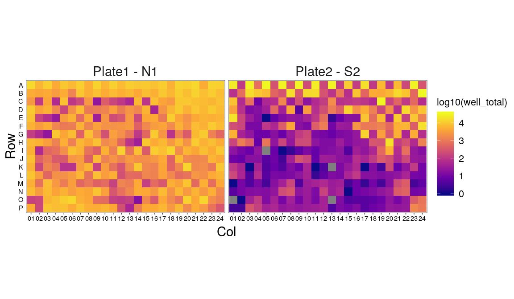<!-- -->

The N1 assay looks to have much higher coverage, even though we normed
the plates to the same total.

Regarding the N1 to S2 difference in depth, let’s sum across the plates:

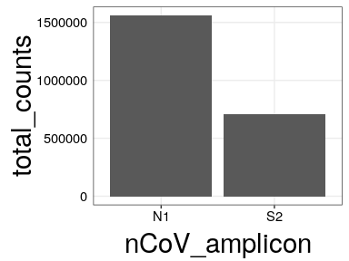<!-- -->

N1 assay took about twice as many reads even though we Denovixed them
both and went for 1:1. Could just be quant imprecision?

Let’s look at RPP30 reads between the plates/wells:

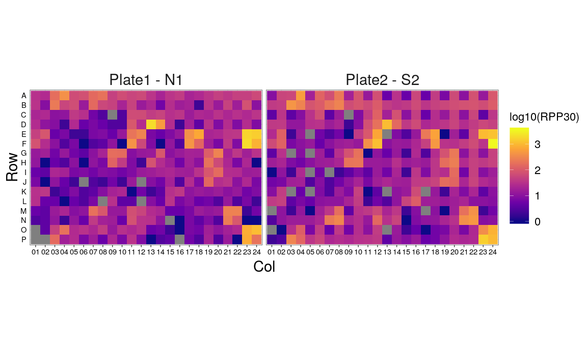<!-- -->

It’s surprising that these don’t differ as much. There is some evidence
of winning i7 primers, showing up in blocks of 4 (these were added with
the liquidator).

Let’s move on to look at nCoV reads:

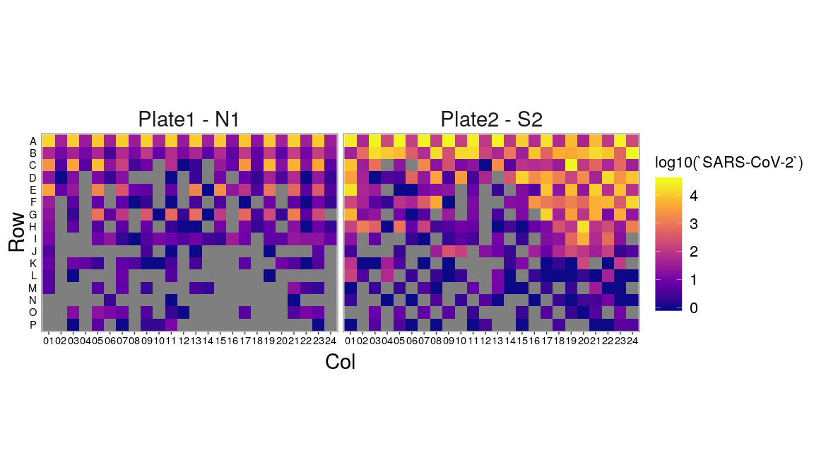<!-- -->

Most of these cluster at the top, which makes sense since that’s where
we added the most copies of nCoV RNA.

Let’s plot this as a proportion of total reads:

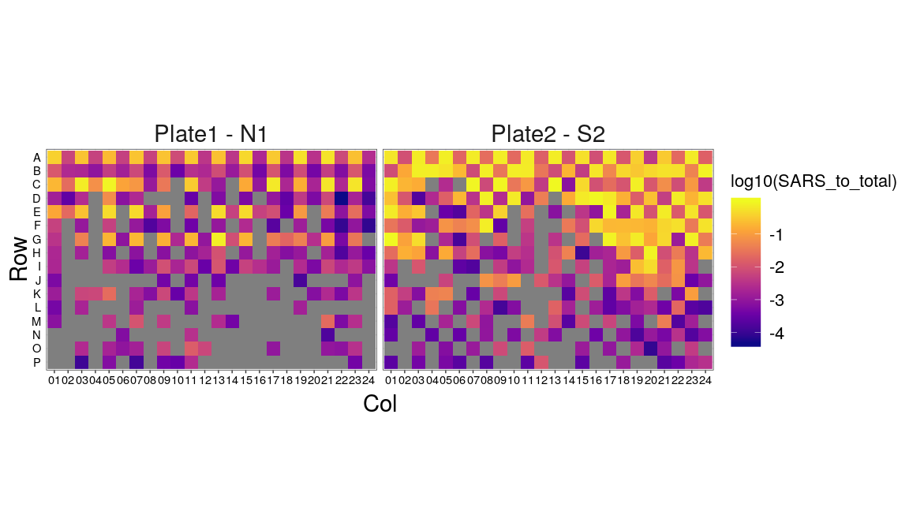<!-- -->

It’s odd that the S2 assay shows more nCoV reads in the top right. We
added lower concentration of sample there.

Let’s plot this out across the range of RNA copies we added in:

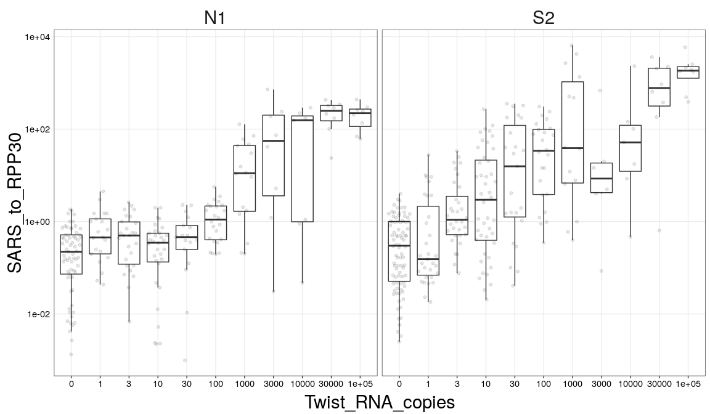<!-- -->

The data are pretty noisy, but it seems that we are seeing a bump in
this proportion around 30 copies for S2 and 100 for N1.

While piling up the raw reads, I noticed that the technical spike in
amplicon was showing up. Let’s plot the spike reads across conditions to
try to get a sense of where they are showing up:

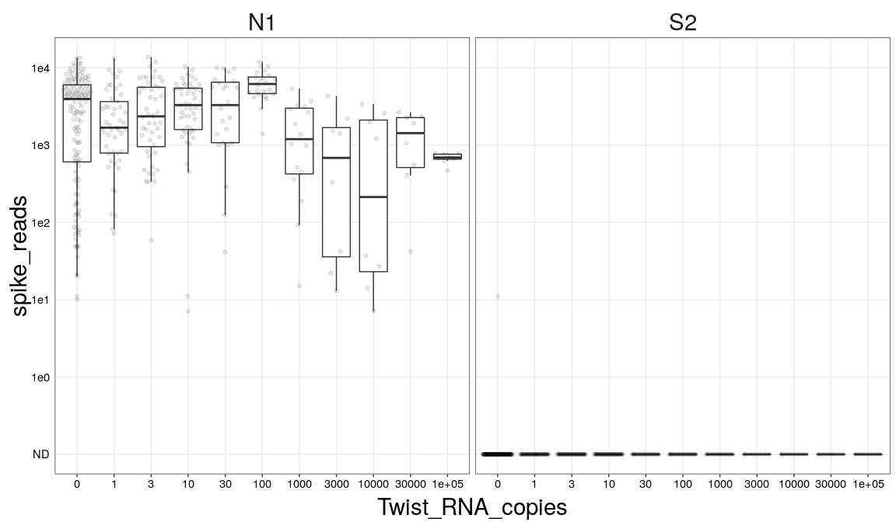<!-- -->

Clearly it’s not showing up in S2, which makes sense since the spike
doesn’t have priming sites for those primers. Let’s drill down on N1 and
look at proportions:

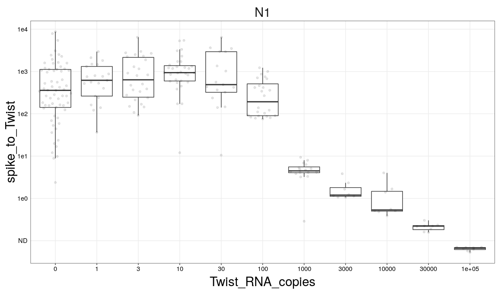<!-- -->

Ratio is 1 at about 3000 copies, so that’s our best estimate for the
level of contamination.

Let’s shift gears to look at barcode contamination. We set up this plate
so that the highest amounts of Twist RNA were put into wells with the
same i5 index. This way, we can estimate barcode contamination by
looking for read contamination into wells that didn’t get Twist RNA,
depending on whether they share the i5 or have a different one. First,
here’s the plate layout of i5s (we had 96 i7s, in a standard 96 grid):

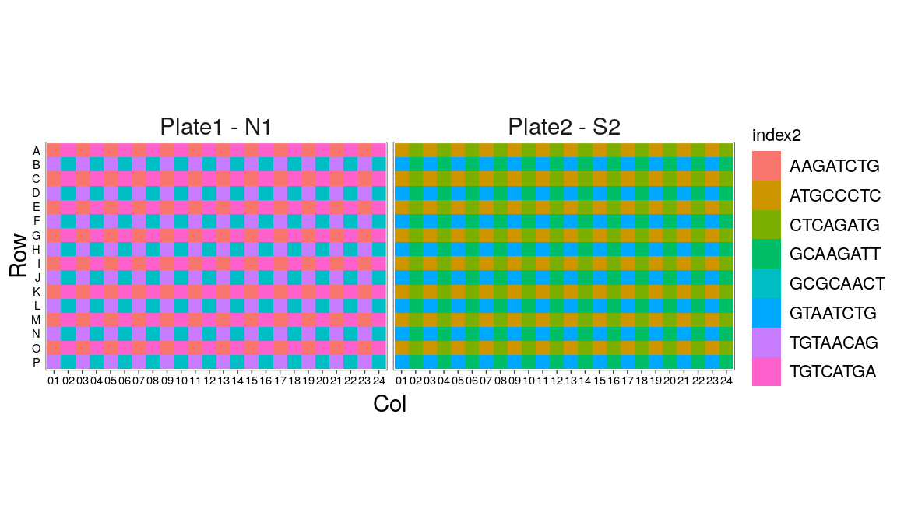<!-- -->

Now, let’s look at reads in no Twist RNA wells across i5s:

<!-- -->

Does seem like we get more nCoV reads in 0 condition when the i5 has
high template samples, but it’s not that big of an effect. The high
amount of contamination in the rightmost indexes for each assay are
surprising. Let’s put those on a plate map:

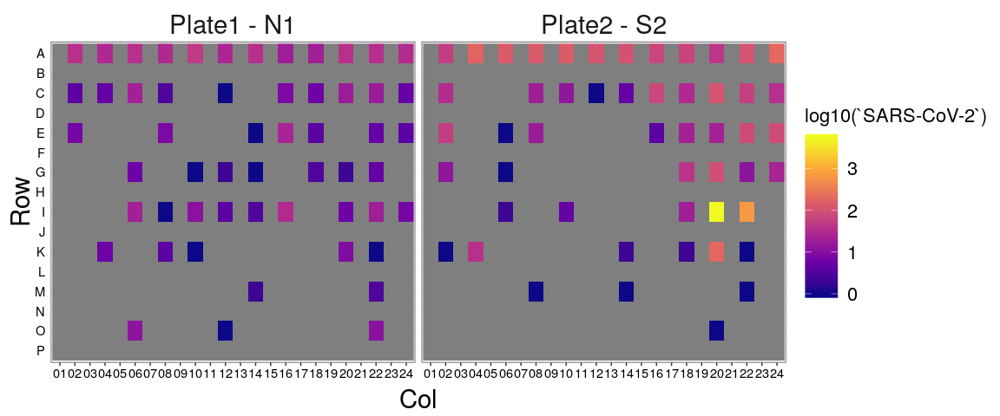<!-- -->

Seems like this is mostly happening in row 1 (not sure why it is worse
in the S2 plate). This is where we have the highest amount of Twist RNA
being put in with the D300, as shown in this plate map:

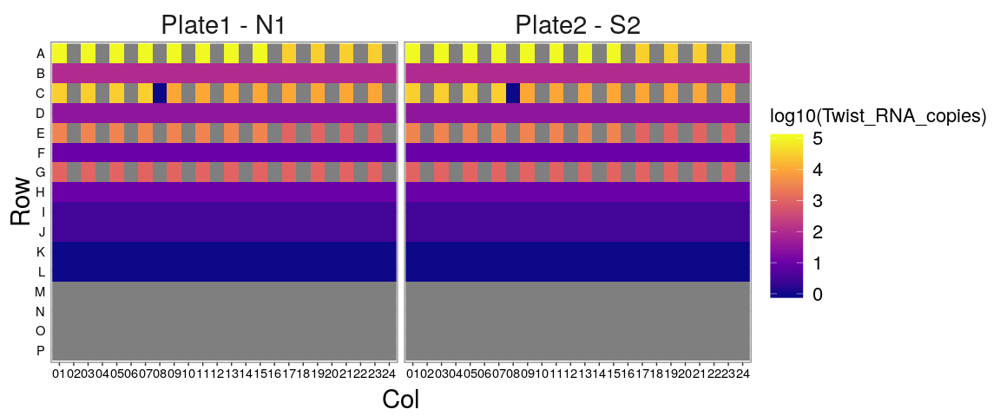<!-- -->

Based on these last few plots, we’ll use pipettors and the liquidator to
set up the next run. We’re concerned about the D300 possibly dispensing
into the wrong wells.
