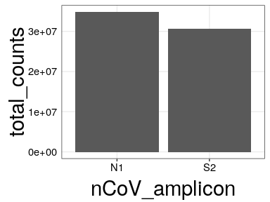
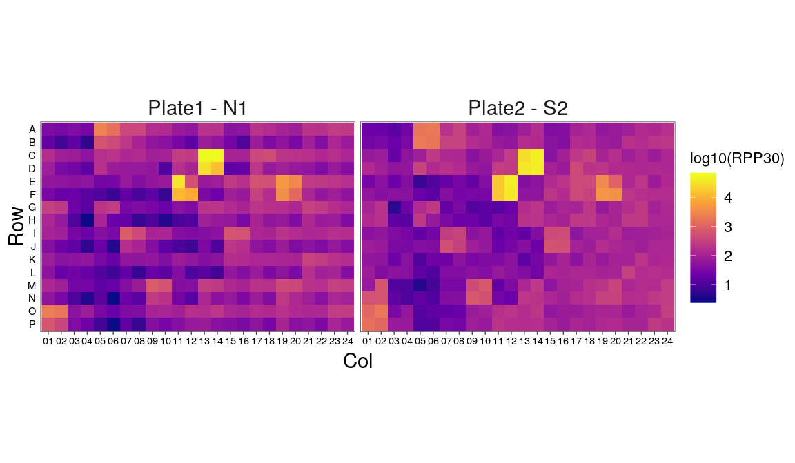
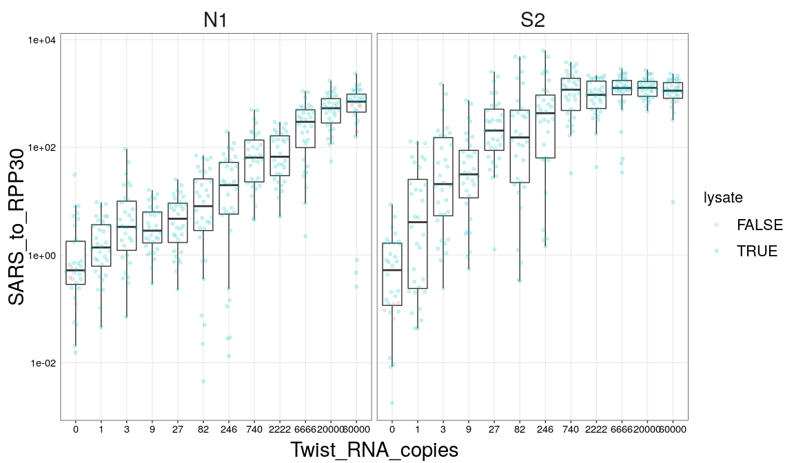
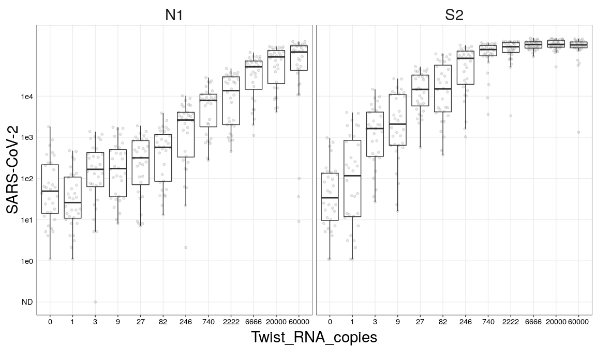
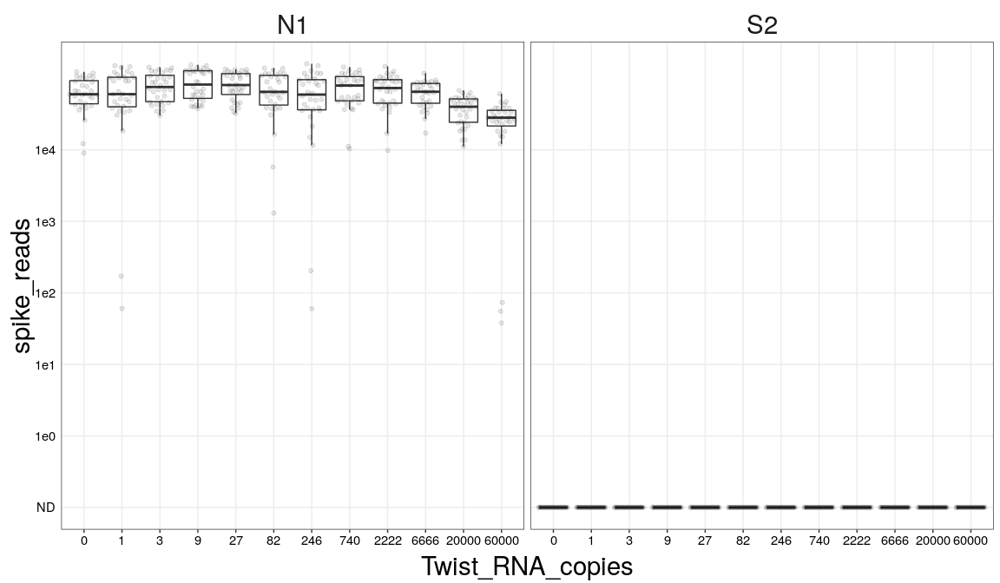
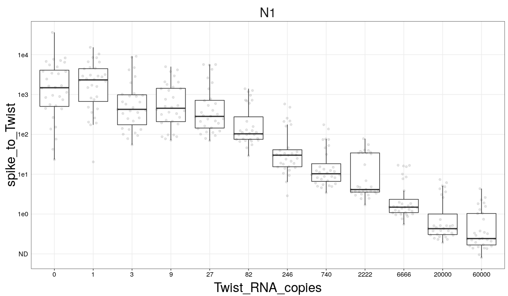
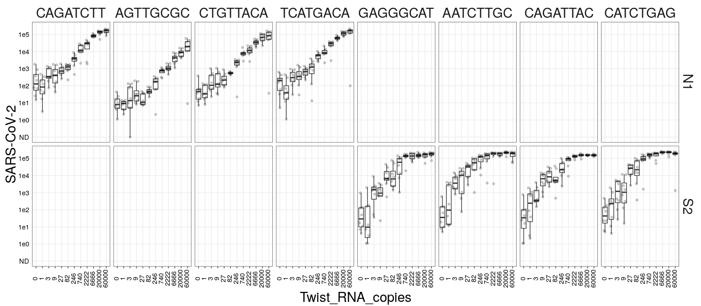

SARS-CoV-2 platform run 2 analysis
================
Aaron
04/02/2020

  - [TLDR](#tldr)

# TLDR

This was our second run. Just like run 1, we assayed synthetic Twist
SARS-CoV-2 RNA molecules from 100,000 copies to 1 copy per well (and
negative controls) in the background of human cell line (HEK293T)
lysate. In each well we amplified CoV RNA with either the N1 or S2
primer set at 400 nM and human RNase P with 200 nM primers. However,
different from run 1 we only amplified for 40 cycles (gels were a tad
messy from run 1 and a looked a lot cleaner here) and used serial
dilution to add the Twist RNA instead of our Tecan D300e. Overall,
results looked a lot cleaner - especially for the S2 set and it looks
like we can see signal down to \< 10 molecules. We ran this with a
Nextseq High Output kit.

Let’s first just look at reads per well across our plates:

<!-- -->

N1 has more even coverage this time. Pretty, pretty, pretty even. S2
looks more variable, but about the same as run3.

Regarding the N1 to S2 difference in depth, let’s sum across the plates:

<!-- -->

We are close to 1:1 this time, unlike run01.

Let’s look at RPP30 reads between the plates/wells:

<!-- -->

These seem more even this time, which is nice. Perhaps it’s the 40
cycles of PCR instead of 45. There is still evidence of winning i7
primers, showing up in blocks of 4 (these were added with the
liquidator). The winners are different this time, though?

Let’s move on to look at nCoV reads:

<!-- -->

We did highest conc at right of plate for this expt, so this makes
sense.

Let’s plot this as a proportion of total reads:

<!-- -->

Let’s plot this out across the range of RNA copies we added in:

<!-- -->

The data are less noisy than run01. Are we getting signal from S2 assay
at 3 copies?? This is unreal.

Let’s look at raw reads to see clearly where we’re getting none:

<!-- -->

We get some number of reads for nCoV in every well.

We still have the technical spike oligo issue, so let’s plot the spike
reads across conditions to try to get a sense of where they are showing
up:

<!-- -->

Clearly it’s not showing up in S2, which makes sense since the spike
doesn’t have priming sites for those primers. Let’s drill down on N1 and
look at proportions:

<!-- -->

Ratio is 1 between 2e3 and 6e3, agreeing with run01. Still our best
estimate for the level of contamination.

Now, let’s look at SARS reads across Twist RNA amounts, across our i5s:

<!-- -->

Some i5s look better than others. Need to think more about this.
